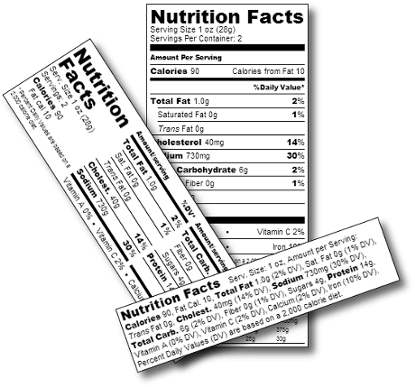
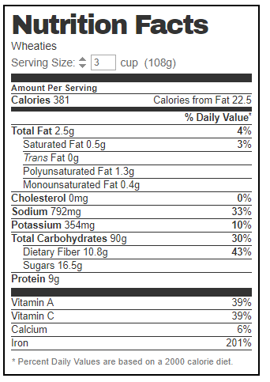
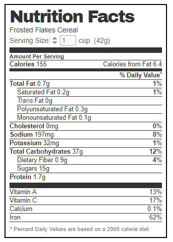
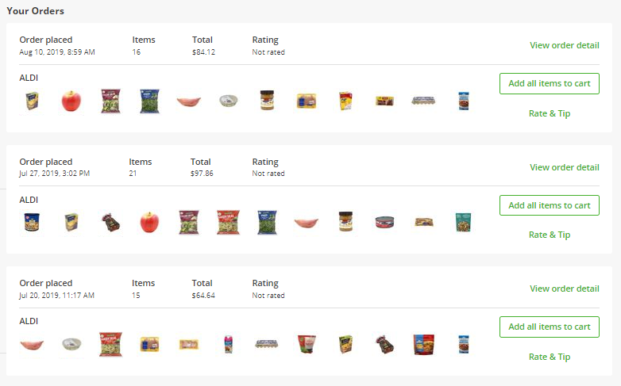
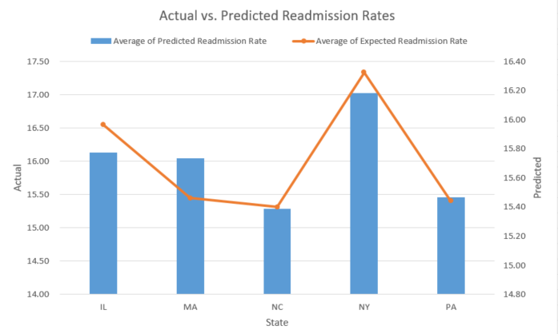

```{r setup, include=FALSE}
#git test
knitr::opts_chunk$set(
    echo = FALSE
  , warning = FALSE
  , message = FALSE
  , collapse = TRUE
  , cache = TRUE
)

library(tidyverse)
library(gridExtra)
library(vroom)
library(ggthemes)
library(png)
library(grid)
library(lubridate)
library(scales)
library(kableExtra)
library(gganimate)


source("theme_soa.R")
```

```{r}
my_void <- theme_void() +
  theme(
    text = element_text(size = 20)
    , legend.position = 'none'
  )

my_minimal <- theme_minimal() +
  theme(
    text = element_text(size = 20)
  )

my_classic <- theme_classic() + 
  theme(
    text = element_text(size = 20)
  )

my_percent <- function(x) {
  scales::percent(x, accuracy = 0.1)
}

my_args <- list(big.mark = ',', digits = 0, scientific = FALSE)
```

## Where to find this

This presentation may be found at: https://pirategrunt.com/soa_symposium_2019/

Code to produce the examples and slides: https://github.com/PirateGrunt/soa_symposium_2019

## What we'll talk about

* Communication efficiency
* Every picture tells a story

# Communication efficiency

## {data-background=white}

## {.gigantic-text}

9 

## {.center}

Which of these two numbers is larger? 

##

<div class = 'left very-large-text'>
11
</div>

<div class = 'right very-large-text'>
9
</div>

## {.center}

How about these two?

##

<div class = 'left large-text'>
1011
</div>

<div class = 'right large-text'>
1001
</div>

## {.center}

These?

##

<div class = 'left very-large-text'>
IX
</div>

<div class = 'right very-large-text'>
XI
</div>

## {.center}

And these?

##

<div class = 'left very-large-text'>
9
</div>

<div class = 'right very-large-text'>
B
</div>

## {.center}

These?

##

<div class = 'left large-text'>
十一
</div>

<div class = 'right large-text'>
九
</div>

## {.center}

How about these?

##

```{r}
tibble(
    val = c('left', 'right')
  , size = c(11, 9)
) %>% 
  ggplot(
    aes(val, size)
  ) + 
  geom_bar(position = 'dodge', stat = 'identity') + 
  my_void
```

## {.center}

nine

9

neun

1001

九

IX

nueve

##  {.center}

<div class = 'left'>
Arabic or sanskrit are no more legitimate than any other representation of numbers.
</div>

<div class = 'right'>

Be prepared to accept the idea that there are circumstances when geometric primitives may be understood _faster_.
</div>

## This is actually _too much_ information

```{r}
tibble(
    val = c('left', 'right')
  , size = c(11, 9)
) %>% 
  ggplot(
    aes(val, size)
  ) + 
  geom_bar(position = 'dodge', stat = 'identity') + 
  my_void
```

## This is better

```{r fig.width=4}
tibble(
    val = c('left', 'right')
  , size = c(11, 9)
) %>% 
  ggplot(
    aes(val, size)
  ) + 
  geom_bar(position = 'dodge', stat = 'identity', width = 0.1) + 
  my_void
```

##

Statistics maps a set of many numbers into a set of fewer numbers.

```{r}
set.seed(1234)
mean <- 10e3
cv <- 0.3
sigma <- sqrt(log(1 + cv^2))
mu <- log(mean) - sigma^2/2

tbl_obs <- tibble(
  x = rlnorm(5e3, mu, sigma)
  , y = rgamma(5e3, 1 / cv^2, scale = mean * cv ^ 2)
)

tbl_obs_long <- tbl_obs %>% 
  tidyr::gather(sample, value)

tbl_obs <- tbl_obs %>% 
  mutate(
    yen = x * 137
  )

summary_x <- tbl_obs$x %>% 
  summary()

summary_y <- tbl_obs$y %>% 
  summary()

summary_yen <- tbl_obs$yen %>% 
  summary()

tbl_summary <- data.frame(
  metric = names(summary_x)
  , x = summary_x %>% as.numeric()
  , y = summary_y %>% as.numeric()
  , yen = summary_yen %>% as.numeric()
)
```

```{r}
mean_sample <- tbl_obs$x %>% mean()
sd_sample <- tbl_obs$x %>% sd()
```

```{r }
tbl_obs$x %>% 
  summary()
```

## {.center}

```{r }
tbl_summary %>%
  select(metric, x) %>% 
  knitr::kable(
    format.args = my_args
  )
```

## 

```{r}
plt_base <- tbl_obs %>% 
  ggplot(aes(x))

plt_hist <- plt_base + 
  geom_histogram(
      aes(y = stat(density))
    , fill = 'grey'
    , color = 'black')

plt_density <- plt_base + 
  geom_density(fill = 'grey')

grid.arrange(
    nrow = 1
  , plt_hist
  , plt_density
)
```

## 

```{r}
mean_x <- tbl_obs$x %>% mean()

grid.arrange(
    nrow = 1
  , plt_hist + geom_vline(xintercept = mean_x, color = 'red')
  , plt_density + geom_vline(xintercept = mean_x, color = 'red')
)
```

##

```{r}
conf_95 <- quantile(tbl_obs$x, c(.05, .95))

grid.arrange(
    nrow = 1
  , plt_hist + 
      geom_vline(xintercept = mean_x, color = 'red') + 
      geom_vline(xintercept = conf_95, color = 'black', alpha = 0.6)
  , plt_density + geom_vline(xintercept = mean_x, color = 'red')  + 
      geom_vline(xintercept = conf_95, color = 'black', alpha = 0.6)
)
```

##

<div class = 'left'>

```{r }
tbl_summary %>% 
  select(metric, x) %>% 
  knitr::kable(
    format.args = my_args
  )
```

</div>

<div class = 'right'>

```{r fig.height = 8}
plt_hist + 
  geom_vline(xintercept = mean_x, color = 'red') + 
  geom_vline(xintercept = conf_95, color = 'black', alpha = 0.6)
```

</div>

## {.center}

Summary statistics are _always_ a reduction of information.

Visualization presents (almost) _all_ of the data. The reductions are made with our eyes.

## Potential complaint 

<div class = 'center'>
Focus on visual design places undue emphasis on superfluous characteristics like color, font, etc.
</div>

## {.center}

What's the most important word in the text which follows?

##

The rate for territory X must be **<u>increased</u>** by 10.4%.

## {.center}

And this one?

##

The rate for **<u>territory</u>** X must be increased by 10.4%.

## {.center}

"Inessential" matters. Emphasis is an element of communication and therefore comprehension.

## {.center}

Are you ready to buy stock in this company?

## {.center .unprofessional}

This year we plan top build on last year's renewed profitability.

# A picture can speak a thousand words

## A real life example: improving my diet

```{r}

```


## Speed test: which is healthier, A or B?


<div class = 'left'>

```{r fig.width=4, fig.height=7}

```

</div>

<div class = 'right'>

```{r fig.width=4, fig.height=7}

```

</div>


## Weaknesses

- Serving sizes are inconsistent
- Converting units requires a calculator
- Each food has it's own label
- Data collection is slow

## A better data source 

```{r}

```

## My daily calories for the last four months

```{r}
orders <- read_csv("data/orders.csv")
orders_nutrition <- read_csv("data/orders_nutrition.csv")

p <- orders_nutrition %>% 
  mutate(week = week(date)) %>% 
  filter(month(date) < 8, month(date) > 2) %>% 
  group_by(week) %>% 
  summarise(calories = sum(calories)/7) %>% 
  ggplot(aes(week, calories)) + 
  geom_line() + 
  theme_minimal() +
  scale_x_continuous(labels = seq(ymd("2019-03-01"), ymd("2019-07-31"), by = "month")) + 
  xlab("Date") + 
  ylab("Calories Per Day") + 
  ggtitle("Daily Calories") + 
  ylim(1000, 5000) + 
  transition_reveal(week)

animate(p,
        duration = 60, # 32 weeks * 4 sec/week = 120 seconds
        fps = 15
        )
```

## The picture that speaks a thousand words

```{r}
measure_columns <- c("calories", "total_fat_g", "sat_fat_g", "trans_fat_g", "cholesterol_mg", "sodium_mg", "total_carbs_g", "dietary_fiber_g", "sugars_g", "protein_g")

nutrition_benchmarks <- tibble(
  stat = measure_columns,
  benchmark = c(3000, #calories
                150,#total fat
                0,#sat fat
                0,#trans fat
                600,#cholesterol
                2000,#sodium (centi-grams)
                600,#carbs
                25,#dietary fiber
                40,#sugars
                125 #protein... 175 - 50 from protein shake
                )
)

```

```{r fig.width=10}
p <- orders_nutrition %>% 
  select(date, measure_columns) %>% 
  mutate(month = month(date)) %>% 
  filter(month < 8, month > 2) %>% 
  group_by(month) %>% 
  mutate_at(measure_columns, ~sum(.x, na.rm = T)/unique(days_in_month(date))) %>% 
  gather(stat, value, -month, -date) %>% 
  filter(month >2, stat != "sat_fat_g", stat != "trans_fat_g", stat != "total_carbs_g") %>% 
  left_join(nutrition_benchmarks, by = "stat") %>% 
  mutate(percent = ifelse(value/benchmark<2.4, value/benchmark, 2.4),
         stat = case_when(
    stat == "calories" ~ "Calories",
    stat == "cholesterol_mg" ~ "Cholesterol",
    stat == "dietary_fiber_g" ~ "Dietar Fiber",
    stat == "protein_g" ~ "Protein",
    stat == "sat_fat_g" ~ "Saturated Fat",
    stat == "sodium_mg" ~ "Sodium",
    stat == "sugars_g" ~ "Sugars",
    stat == "total_carbs_g" ~ "Total Carbs",
    stat == "total_fat_g" ~ "Total Fat",
    stat == "trans_fat_g" ~ "Trans Fat",
    T ~ "NA"
  ) %>% 
    fct_relevel(c(
      "Calories","Protein (g)","Sugars (g)","Total Carbs (g)","Cholesterol (mg)","Dietar Fiber (g)","Saturated Fat (g)","Sodium (mg)","Total Fat (g)","Trans Fat (g)", "NA"))
  ) %>% 
  mutate(stat = fct_rev(stat)) %>% 
  ggplot(aes(date, percent, color = stat)) + 
  geom_line() + 
  geom_point() + 
  scale_y_continuous(labels = percent, limits = c(0, 2.5)) +
  theme_minimal() + 
  theme(legend.position="top") +
  geom_hline(yintercept = 1.00, color = "black", size = 1.3, alpha = 0.5) +
  transition_reveal(date) + 
  ylab("% of Daily Value") + 
  xlab("Date")

animate(p,
        duration = 100,
        fps = 5
        )
```

## The price of triple chocolate cake

<div class = 'left'>

```{r}
orders_nutrition %>% 
  filter(month(date) < 8) %>% 
  mutate(month = week(date)) %>% 
  group_by(month) %>% 
  summarise(percent_sugar = sum(sugars_g*4)/sum(calories)) %>% 
  ggplot(aes(month, percent_sugar)) + 
  geom_line() + 
  theme_minimal() + 
  annotate("rect", xmin = 12, xmax = 16, ymin = 0.12, ymax = 0.2, alpha = 0.2,color = "red") +
  scale_y_continuous(labels = percent) + 
  xlab("Month") + 
  ylab("Percent of Sugar of Calories") +
  scale_x_continuous(labels = seq(ymd("2019-03-01"), ymd("2019-07-31"), by = "month")) +
  scale_y_continuous(labels = percent, limits = c(0, 0.3)) 

```


</div>

<div class = 'right'>

```{r fig.width=3}
orders_nutrition %>% 
  filter(name == "Village Bakery Triple Chocolate Creme Cake") %>% 
  ungroup() %>% 
  select(name, measure_columns) %>% 
  gather(stat, value) %>% 
   mutate(stat = case_when(
    stat == "calories" ~ "Calories",
    stat == "cholesterol_mg" ~ "Cholesterol (mg)",
    stat == "dietary_fiber_g" ~ "Dietar Fiber (g)",
    stat == "progein_g" ~ "Protein (g)",
    stat == "sat_fat_g" ~ "Saturated Fat (g)",
    stat == "sodium_mg" ~ "Sodium (mg)",
    stat == "sugars_g" ~ "Sugars (g)",
    stat == "total_carbs_g" ~ "Total Carbs (g)",
    stat == "total_fat_g" ~ "Total Fat (g)",
    stat == "trans_fat_g" ~ "Trans Fat (g)",
    T ~ "NA"
  )) %>% 
  filter(stat != "NA") %>% 
  mutate(value = comma(as.numeric(value)*10)) %>%  #multiply by servings per container)
  rename(`Nutrition Facts` = stat) %>% 
  kable("html", caption = "Triple Chocolate Cake") %>% kable_styling(bootstrap_options = c("condensed"))
```


</div>

## The two use cases for data visualization

* Exploratory analyis
* Persuading an audience

## Exploratory analysis requires speed and iteration

```{r}
knitr::include_graphics('images/hadley_data_lifecycle.png')
```

## Data visualization communicates your brand

```{r fig.width= 5, fig.height=5}
iris %>% 
  ggplot(aes(Sepal.Width, Sepal.Length, color = Species)) + 
  geom_point() +
  ggtitle("Default MS Excel Graphics") + 
  theme_excel_new() + 
  theme(text=element_text(size=16,  family="Calibri"))
```

## Data visualization communicates your brand

```{r }
img <- readPNG("images/soa_logo.png")
logo <- rasterGrob(img, interpolate = T)

qplot(1:10, 1:10, geom = "blank") + 
  annotation_custom(logo) 

gg <- iris %>% 
  ggplot(aes(Sepal.Width, Sepal.Length, color = Species)) + 
  geom_point(size = 2, shape = 15) +
  labs("") + 
  theme(legend.position = "top") + 
  xlab("Width") + 
  ylab("Length") +
  theme_excel_new() + 
  ggtitle("Branded Graphics") + 
  labs( subtitle = "Based on the Economist's theme \nfrom the 'ggthemes' package",
        caption = "Copyright 2019 YourBrandName \nUsed without Permission") + 
   annotation_custom(logo, ymin = 8, ymax = 8.5, xmin = 4, xmax = 4.5) +
  scale_color_tableau() + 
    theme(plot.title = element_text(family = "Verdana",
                     colour = "#023852", 
                     size = 18,
                     face = "bold",
                     hjust = 0.5),
        plot.caption = element_text(family = "Verdana",
                     colour = "#023852", 
                     size = 12, 
                     hjust = 0),
        plot.subtitle = element_text(family = "Verdana",
                     colour = "#023852", 
                     size = 12, 
                     hjust = 0.5),
        axis.line.x = element_line(color="#023852"),
        axis.line.y = element_line(color="#023852"))

gt <- ggplot_gtable(ggplot_build(gg))
gt$layout$clip[gt$layout$name == "panel"] <- "off"
grid.draw(gt)
```

## Automation is the key to speed

```{r echo = T, eval = F}
library(custom_library)

data %>% 
  ggplot(x, y) + 
  geom_point() + 
  my_custom_theme()
```


## The best graphs are easy to read

```{r fig.height=4}
readmissions <- read_csv("data/hospital_readmission_rates.csv", na = "Not Available")

readmissions %>% 
  ggplot(aes(`Number of Readmissions`)) + 
  geom_density(fill = "lightBlue") +
  ggtitle("Hospital Readmissions") + 
  theme_excel() + 
  theme(text = element_text(size = 8))
```

* What are the y-axis "density" units?  
* How can this be translated into english?

## The best graphs are easy to read

```{r fig.height=4}
readmissions %>% 
  ggplot(aes(`Number of Readmissions`)) + 
  geom_histogram(binwidth = 20, color = "Light Grey", size = 1.2) + 
  xlim(0, 300) + 
  theme_soa() + 
  ggtitle("Distribution of Hospital Readmissions") + 
  xlab("Number of Readmissions") + 
  ylab("Number of Hospitals") + 
  labs( subtitle = "Based on Five Thirty Eight's Theme \nfrom the 'ggthemes' package",
        caption = "Copyright 2019 YourBrandName \nData Source: HealthData.gov") + 
   annotation_custom(logo, ymin = 8.5, ymax = 9, xmin = 4, xmax = 4.5) + 
  scale_x_continuous(breaks = seq(10, 300, 20),minor_breaks = seq(0, 300, 10), limits = c(0, 300)) + 
  scale_y_continuous(labels = comma) +
  theme(plot.title = element_text(family = "Verdana",
                     colour = "black", 
                     size = 14, 
                     hjust = 0.5),
        plot.caption = element_text(family = "Verdana",
                     colour = "darkGrey", 
                     size = 14, 
                     hjust = 0),
        plot.subtitle = element_text(family = "Verdana",
                     colour = "black", 
                     size = 14, 
                     hjust = 0.5))
```

* In english: "There are just over 2,000 hospitals with between 30 and 50 readmissions"

## Graphs should be unambiguous

<div class = 'left'>

* Which axis is the Actual and which is the Predicted?  
* The blue bars take up more visual space than the lines, but both units are equally important
* X-axis ontinuous scale does not make sense

</div>

<div class = 'right'>



</div>

## A step in the right direction

```{r}
readmissions %>% 
  filter(State %in% c("IL", "MA", "NC", "NY", "PA")) %>%
  group_by(State) %>% 
  summarise(
    mean_predicted = mean(`Predicted Readmission Rate`, na.rm = TRUE)
    , mean_expected = mean(`Expected Readmission Rate`, na.rm = TRUE)
  ) %>% 
  ggplot(aes(mean_expected, mean_predicted)) + 
  geom_text(aes(label = State,label.size = 2)) + 
  my_minimal
```


## Uncertainty should be shown

```{r }
readmissions %>% 
  filter(State %in% c("IL", "MA", "NC", "NY", "PA")) %>% 
  mutate(ave = `Expected Readmission Rate`/`Predicted Readmission Rate`) %>% 
  ggplot(aes(State, ave)) + 
  geom_boxplot(outlier.alpha = 0.2, alpha = 0.7) + 
  coord_flip() + 
  theme_soa() + 
  ggtitle("Actual vs Expected Readmission Ratio") + 
  ylab("Actual/Predicted") +
  labs( subtitle = "Based on Five Thirty Eight's Theme \nfrom the 'ggthemes' package",
        caption = "Copyright 2019 YourBrandName \nData Source: HealthData.gov") + 
  annotation_custom(logo, ymin = 8.5, ymax = 9, xmin = 4, xmax = 4.5) + 
    theme(plot.title = element_text(family = "Verdana",
                     colour = "black", 
                     size = 12, 
                     hjust = 0),
        plot.caption = element_text(family = "Verdana",
                     colour = "black", 
                     size = 10, 
                     hjust = 1),
        plot.subtitle = element_text(family = "Verdana",
                     colour = "black", 
                     size = 10, 
                     hjust = 0))
```

## Persuading an audience is a *very* different challenge

*How to Win Friends and Influence People - Dale Carnegie*

1. You can't win an arguement
2. Avoid making enemies - Never tell the the audience that they are wrong
3. Put yourself in the other person's shoes
4. Admit when you are wrong
5. Be friendly
6. Get the other person saying "yes, yes" immediately
7. Let the other person see the pattern and come to the conclusion themselves


## Summary

**For exploratory analysis**

1)  Understand the story behind the data
3)  Focus on speed and flexibility 

**For persuading an audience, publishing, or selling your ideas**

1) Build templates
2) Strive for simplicity and professionalism

## {.center}

Thank you!

## Where to find this

This presentation may be found at: https://pirategrunt.com/soa_symposium_2019/

Code to produce the examples and slides: https://github.com/PirateGrunt/soa_symposium_2019